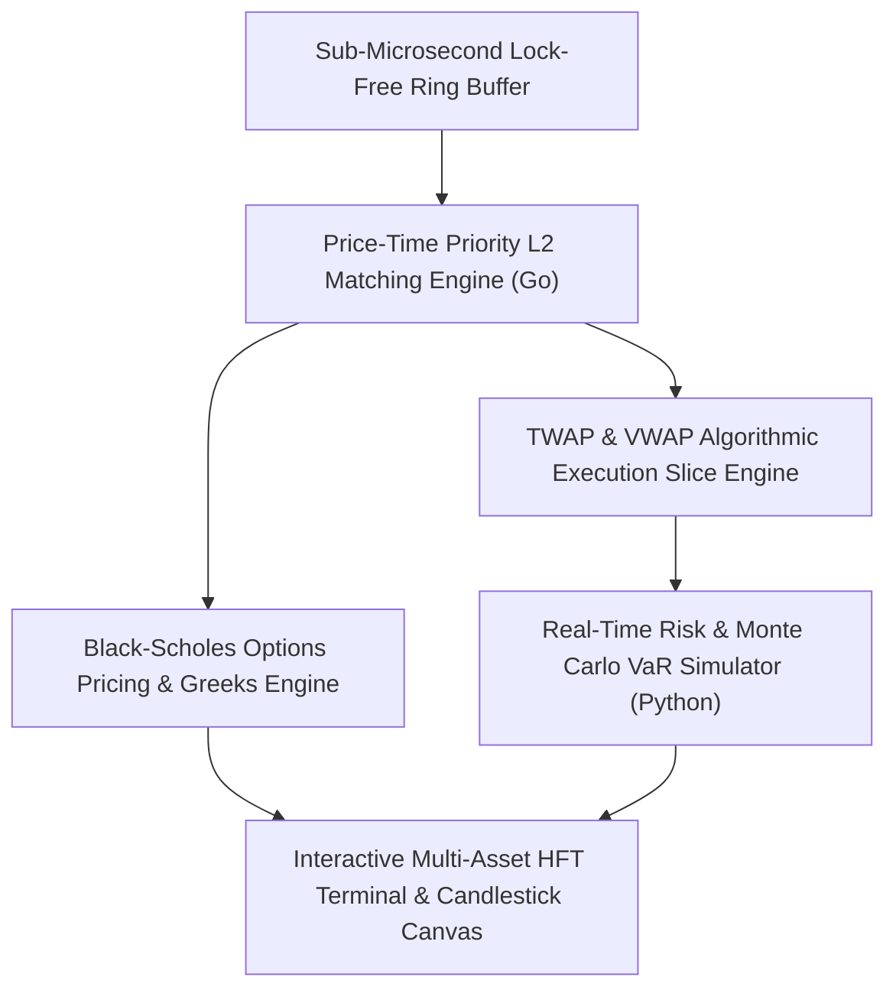

# 📈 FinPulse Engine — High-Frequency Algorithmic Trading & Real-Time Risk Analytics System

> **FinPulse Engine** is an institutional-grade, low-latency quantitative trading platform, VWAP/TWAP algorithmic execution suite, sub-microsecond L2 order book matching engine, and real-time portfolio risk analytics system built by **Yared Kinetibeb Tesfaye**.

---

## 🌟 Key Architecture Highlights

1. **Sub-Microsecond Lock-Free Ring Buffer** (`engine/ring_buffer.go`): Zero-allocation atomic single-producer single-consumer ring buffer for ultra-fast order packet queuing.
2. **Price-Time Priority L2 Order Book** (`engine/matching_engine.go`): High-throughput matching engine supporting `LIMIT`, `MARKET`, and `IOC` order execution.
3. **VWAP / TWAP Algorithmic Execution Slicer** (`algo/execution.go`): Institutional volume-weighted and time-weighted parent order slicing algorithms.
4. **Black-Scholes Options Greeks Engine** (`risk/var_calculator.py`): Real-time Delta ($\Delta$), Gamma ($\Gamma$), Vega ($\mathcal{V}$), Theta ($\Theta$), and Implied Volatility calculation.
5. **Interactive React HFT Terminal**: Live multi-asset class switching (`BTC/USDT`, `ETH/USDT`, `NVDA`, `AAPL`, `EUR/USD`), HTML5 Canvas OHLCV Candlestick charting, L2 depth ladder, and 1-click CSV risk audit exporter.

---

## 💻 Tech Stack

- **Go 1.22**: L2 Matching Engine, Lock-Free Ring Buffer, VWAP/TWAP Algo Execution
- **Python 3.11**: Monte Carlo Portfolio VaR, Sharpe Ratio, Black-Scholes Options Greeks
- **React 18 & HTML5 Canvas**: Real-Time HFT Trading Terminal & Candlestick Charting
- **GitHub Actions**: Automated DevSecOps Build & Benchmark Test CI/CD

---

## 📄 License

Distributed under the MIT License. Copyright (c) 2026 Yared Kinetibeb Tesfaye.
